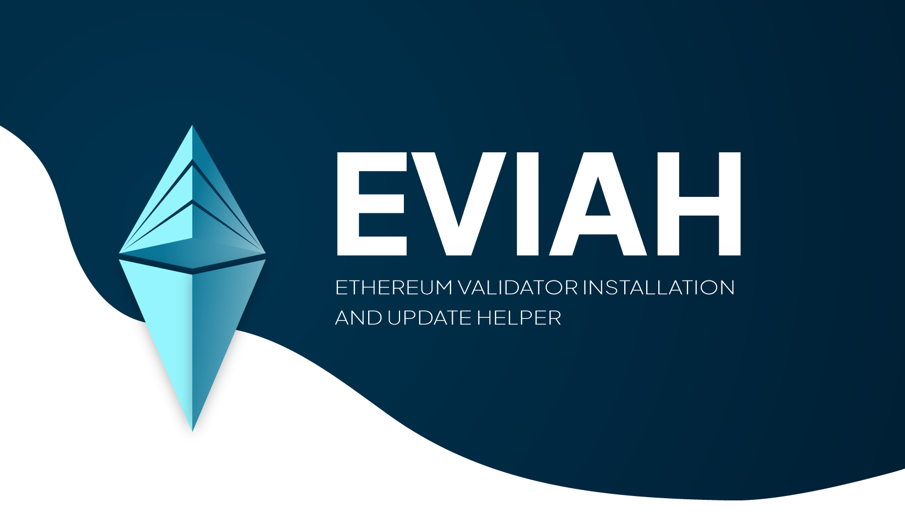

# EVIAH
## Ethereum Validator Installation and Update Helper

Thanks to [u/monochromebow](https://www.reddit.com/user/monochromebow) for the logo.
### WARNING: THIS IS VERY ALPHA SOFTWARE AND 80% ISNT IMPLEMENTED YET!
Testnet and Mainnet supported...
Ubuntu 22.04 LTS supported...
#### Installation:
Clone the repository with:
```shell
git clone https://github.com/GameTec-live/EVIAH.git
```
and then just run the script...
```shell
EVIAH/eviah.sh
```


Thanks to th33xitus for letting me "borrow" some of his code ;)

If anyone is crazy enough to donate to a random developer in Europe, heres my ETH address: 0x1Eb4317add0E70873A88F36987b0003d8830D87D
